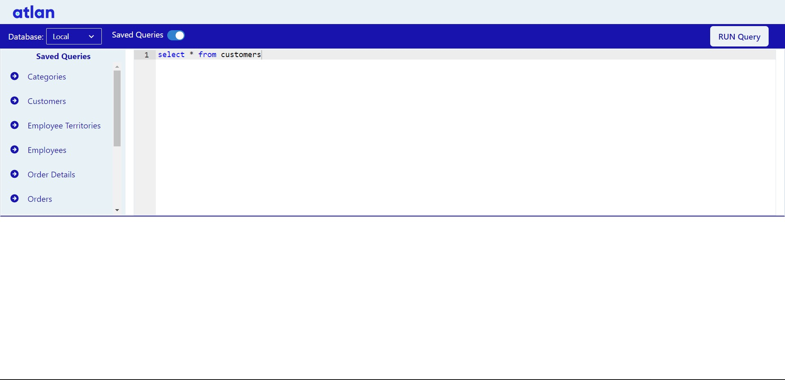
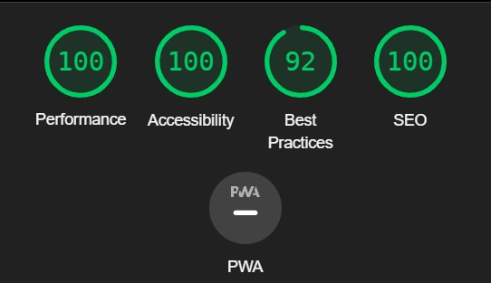
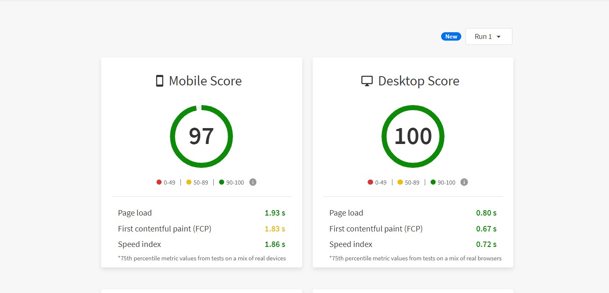
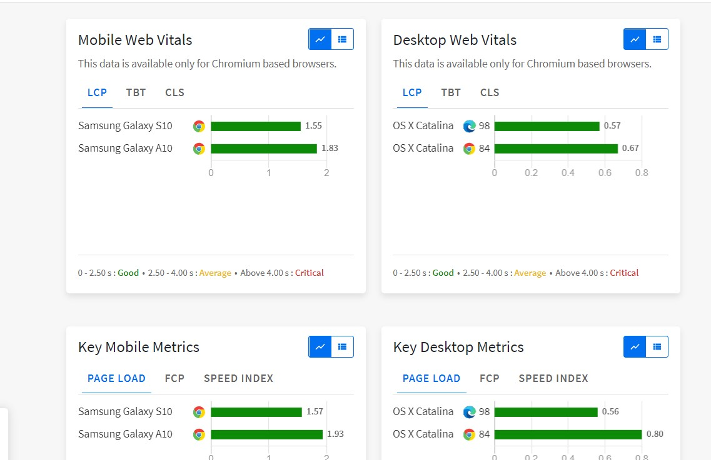

# SQL Editor based on React.js

This is a one page application based on React.js built with Tailwindcss and Chakra-UI.

## Website is LIVE

Follow link : [SQL-Editor](https://sql-editor-sigma.vercel.app/)

## Tech used

Chakra UI 

## 💥Features

✨ Users can run pre-defined queries fetched using a custom hook from Github API\
✨ U Can run Queries using keyboard shortcut `ALT+R`\
✨ U: Records can be searched using search bar\
✨ U: Mobile Friendly\
✨ U Download Data in CSV as well as JSON format\
✨ U Users can see query runtime in milliseconds(ms).

## 💿 Saved Queries

- `select * from customers`
- `select * from categories`
- `select * from employee_territories`
- `select * from order_details`
- `select * from orders`
- `select * from products`
- `select * from regions`
- `select * from shippers`
- `select * from suppliers`
- `select * from territories`

## ⏱ Page Load Time

Page load time is less than 0.5 seconds on Desktop

Test Results from Chrome-Lighthouse🔦🏠 and BrowserStack

### [Lighthouse Chrome DevTools Report](https://developers.google.com/web/tools/lighthouse#devtools)

### [BrowserStack Report](https://www.browserstack.com/speedlab)

## Available Scripts

In the project directory, you can run:

### `npm start`

Runs the app in the development mode. 
Open [http://localhost:3000](http://localhost:3000) to view it in the browser.

The page will reload if you make edits. 
You will also see any lint errors in the console.

### `npm test`

Launches the test runner in the interactive watch mode. 
See the section about [running tests](https://facebook.github.io/create-react-app/docs/running-tests) for more information.

### `npm run build`

Builds the app for production to the `build` folder. 
It correctly bundles React in production mode and optimizes the build for the best performance.

The build is minified and the filenames include the hashes. 
Your app is ready to be deployed!

See the section about [deployment](https://facebook.github.io/create-react-app/docs/deployment) for more information.

### `npm run eject`

**Note: this is a one-way operation. Once you `eject`, you can’t go back!**

If you aren’t satisfied with the build tool and configuration choices, you can `eject` at any time. This command will remove the single build dependency from your project.

Instead, it will copy all the configuration files and the transitive dependencies (webpack, Babel, ESLint, etc) right into your project so you have full control over them. All of the commands except `eject` will still work, but they will point to the copied scripts so you can tweak them. At this point you’re on your own.

You don’t have to ever use `eject`. The curated feature set is suitable for small and middle deployments, and you shouldn’t feel obligated to use this feature. However we understand that this tool wouldn’t be useful if you couldn’t customize it when you are ready for it.
